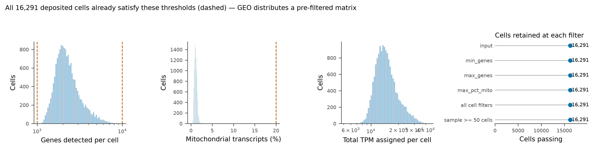
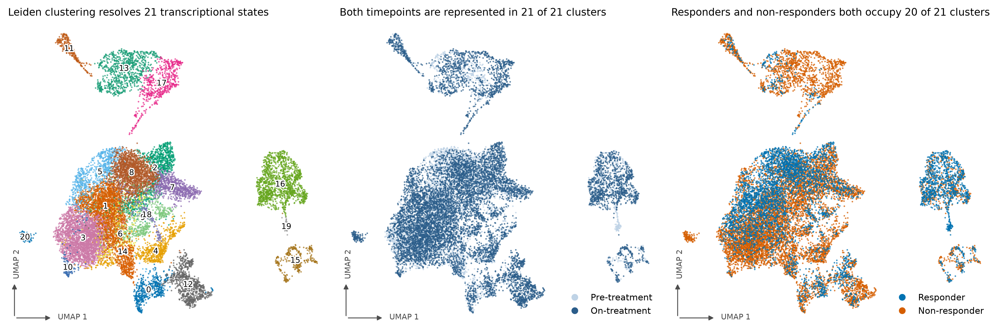
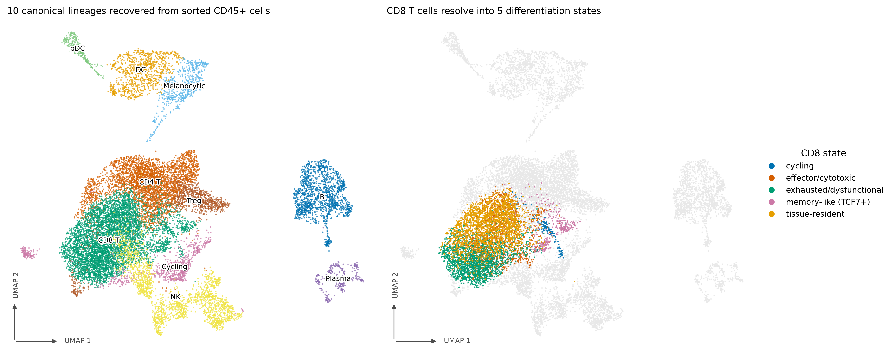
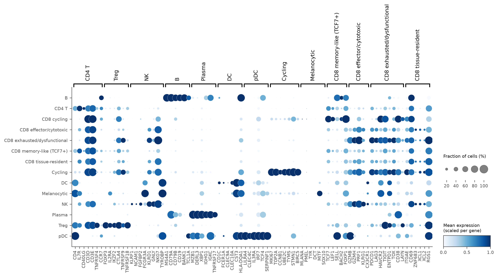
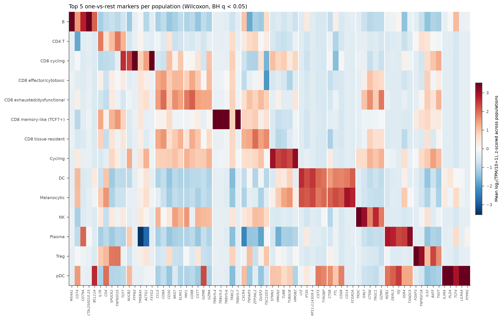
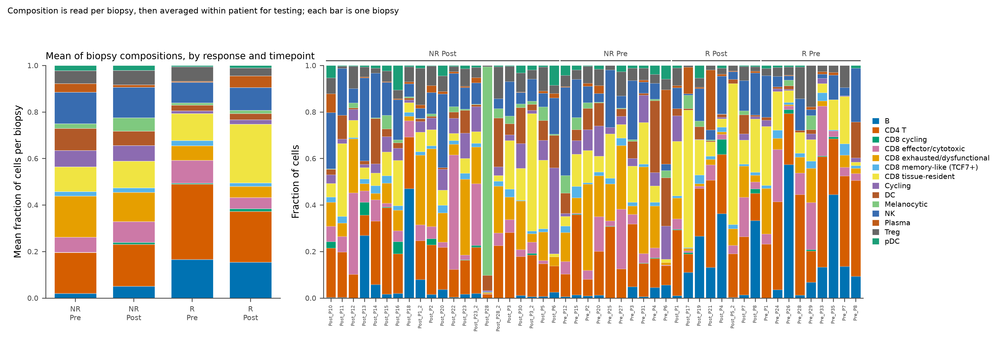
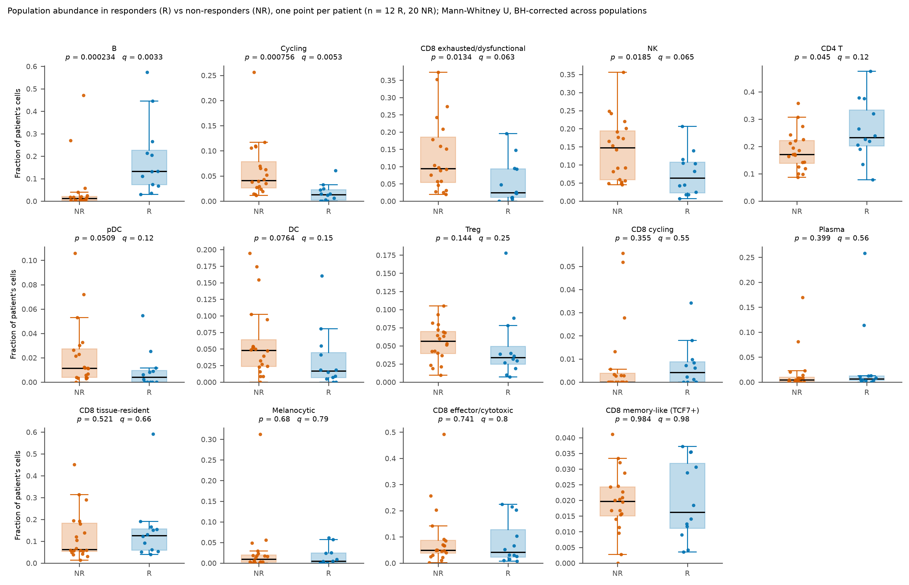
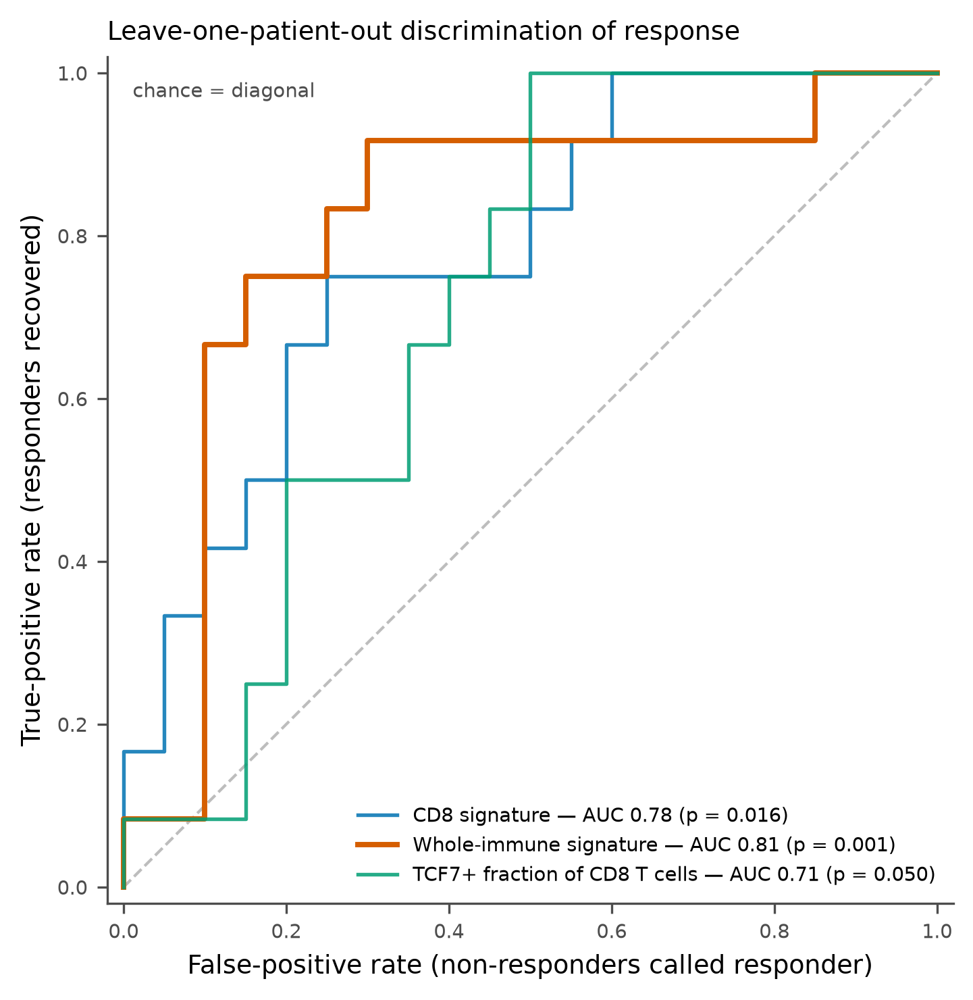
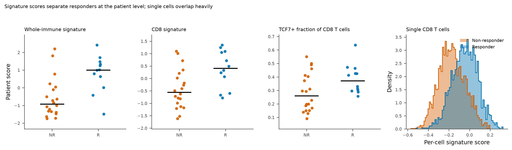

# Cell-population dynamics and response signatures in melanoma checkpoint immunotherapy

**Dataset** GSE120575 — Sade-Feldman *et al.*, *Cell* 175:998-1013 (2018). CD45+ cells from melanoma biopsies, Smart-seq2, distributed as TPM.
**Pipeline** `pipeline/` v1.0.0 · generated 2026-10-01 · random seed 0

## Headline findings

- 16,291 CD45+ cells from 48 biopsies of 32 melanoma patients pass QC and resolve into 21 Leiden clusters spanning 10 immune lineages, with CD8 T cells further split into 5 differentiation states.
- No population changes significantly on treatment: 0 of 14 survive q < 0.1, and 0 reach even a nominal p < 0.05. The strongest trend is CD8 cycling (0.001 -> 0.011 mean fraction, up in 5 of 11 patients, p = 0.0625). With only 11 patients contributing both a pre- and an on-treatment biopsy, this analysis is underpowered for anything but a large effect.
- 4 of 14 populations differ at q < 0.1: B (q = 0.00328, higher in responders), Cycling (q = 0.0053, lower in responders), CD8 exhausted/dysfunctional (q = 0.0627, lower in responders), NK (q = 0.0648, lower in responders).
- 0 genes differ between responders and non-responders in CD8 T cells and 3 across all immune cells at q < 0.1 (patient-level pseudobulk).
- The strongest predictor is Whole-immune signature (AUC 0.81, permutation p = 0.001, n = 32 patients). Per-cell scores overlap almost completely between responders and non-responders: the signal is a property of the patient's immune composition and tone, not of individual cells.

## 1. Data and quality control

The GEO matrix contains 16,291 cells x 55,737 genes from 48 biopsies of 32 patients. After filtering, 16,291 cells (100.0%) and 36,602 genes from 48 biopsies of 32 patients enter the analysis.

Thresholds (`config/config.yaml`): `min_genes` = 1000, `max_genes` = 10000, `max_pct_mito` = 20.0, `min_cells_per_gene` = 10, `min_cells_per_sample` = 50.



| step | n_cells |
| --- | --- |
| input | 16291 |
| min_genes | 16291 |
| max_genes | 16291 |
| max_pct_mito | 16291 |
| all cell filters | 16291 |
| sample >= 50 cells | 16291 |

## 2. Clustering and annotation

Log2(TPM/10+1) expression, 2000 highly variable genes, 30 principal components, a 15-nearest-neighbour graph and Leiden clustering at resolution 1.0 give 21 clusters.



Clusters are labelled by the argmax of z-scored canonical-programme scores. 0.0% of cells fall in clusters where no programme scores above the cross-cluster mean and are left Unresolved. CD8 T cells (5,645 cells) were re-embedded and sub-clustered at resolution 0.5 to resolve differentiation states.



| population | cells | % of cells |
| --- | --- | --- |
| CD4 T | 3454 | 21.2 |
| CD8 tissue-resident | 2157 | 13.2 |
| NK | 1978 | 12.1 |
| CD8 exhausted/dysfunctional | 1801 | 11.1 |
| B | 1473 | 9.04 |
| CD8 effector/cytotoxic | 1224 | 7.51 |
| Treg | 894 | 5.49 |
| DC | 881 | 5.41 |
| Cycling | 811 | 4.98 |
| Melanocytic | 551 | 3.38 |
| CD8 memory-like (TCF7+) | 316 | 1.94 |
| Plasma | 308 | 1.89 |
| pDC | 296 | 1.82 |
| CD8 cycling | 147 | 0.902 |

## 3. Marker genes



Data-driven markers come from a one-vs-rest Wilcoxon rank-sum test per population. All 512,428 gene-population pairs were tested; `cluster_markers.csv` holds the 35,970 that are enriched in their population at BH q < 0.05 and detected in at least 10% of its cells, covering 14 of 14 populations.



## 4. Populations that expand or contract with treatment

Paired Wilcoxon signed-rank on population fractions, pre- versus on-treatment, restricted to the 11 patients who contributed both. The paired design is the only way to read a treatment effect here: biopsy timing is confounded with patient.



| population | n_patients | mean_Pre | mean_Post | log2FC | n_increase | n_decrease | pval | qval |
| --- | --- | --- | --- | --- | --- | --- | --- | --- |
| CD8 cycling | 11 | 0.000591 | 0.0109 | 4 | 5 | 0 | 0.0625 | 0.875 |
| DC | 11 | 0.0992 | 0.0447 | -1.15 | 3 | 8 | 0.147 | 0.979 |
| CD8 tissue-resident | 11 | 0.108 | 0.111 | 0.0364 | 3 | 8 | 0.465 | 0.979 |
| CD4 T | 11 | 0.241 | 0.198 | -0.279 | 5 | 6 | 0.577 | 0.979 |
| CD8 exhausted/dysfunctional | 11 | 0.118 | 0.123 | 0.0577 | 7 | 4 | 0.638 | 0.979 |
| CD8 effector/cytotoxic | 11 | 0.0486 | 0.0724 | 0.574 | 6 | 5 | 0.638 | 0.979 |
| NK | 11 | 0.144 | 0.132 | -0.128 | 5 | 6 | 0.7 | 0.979 |
| B | 11 | 0.0392 | 0.0772 | 0.976 | 6 | 5 | 0.765 | 0.979 |

No population changes significantly on treatment: 0 of 14 survive q < 0.1, and 0 reach even a nominal p < 0.05. The strongest trend is CD8 cycling (0.001 -> 0.011 mean fraction, up in 5 of 11 patients, p = 0.0625). With only 11 patients contributing both a pre- and an on-treatment biopsy, this analysis is underpowered for anything but a large effect.

## 5. Populations associated with response

The patient is the unit of analysis. Biopsies from one patient are not independent, so each patient contributes one fraction per population (the mean over their biopsies) and groups are compared with Mann-Whitney U, BH-corrected across populations.



| population | mean_R | mean_NR | log2FC | auc | pval | qval |
| --- | --- | --- | --- | --- | --- | --- |
| B | 0.19 | 0.0492 | 1.95 | 0.896 | 0.000234 | 0.00328 |
| Cycling | 0.0157 | 0.062 | -1.97 | 0.138 | 0.000756 | 0.0053 |
| CD8 exhausted/dysfunctional | 0.0563 | 0.133 | -1.24 | 0.233 | 0.0134 | 0.0627 |
| NK | 0.0755 | 0.142 | -0.913 | 0.246 | 0.0185 | 0.0648 |
| CD4 T | 0.259 | 0.185 | 0.482 | 0.717 | 0.045 | 0.119 |
| pDC | 0.00971 | 0.022 | -1.17 | 0.29 | 0.0509 | 0.119 |
| DC | 0.0341 | 0.0601 | -0.816 | 0.308 | 0.0764 | 0.153 |
| Treg | 0.0485 | 0.0547 | -0.174 | 0.342 | 0.144 | 0.253 |

4 of 14 populations differ at q < 0.1: B (q = 0.00328, higher in responders), Cycling (q = 0.0053, lower in responders), CD8 exhausted/dysfunctional (q = 0.0627, lower in responders), NK (q = 0.0648, lower in responders).

## 6. Differential expression, responder vs non-responder

Patient-level pseudobulk (mean log2(TPM/10+1) over a patient's cells), Welch t-test, BH across genes. Full tables: `responder_DE_all.csv` (10,538 genes, 3 at q < 0.1) and `responder_DE_CD8.csv` (9,466 genes, 0 at q < 0.1).

**Top genes, all immune cells**

| gene | mean_log2_R | mean_log2_NR | log2FC | auc | pval | qval |
| --- | --- | --- | --- | --- | --- | --- |
| TRGV9 | 0.0291 | 0.0661 | -0.037 | 0.0792 | 7.06e-06 | 0.0726 |
| RP11-815N9.2 | 0.0172 | 0.0491 | -0.0319 | 0.108 | 1.81e-05 | 0.0726 |
| RP11-274E7.2 | 0.133 | 0.235 | -0.102 | 0.0917 | 2.07e-05 | 0.0726 |
| GZMH | 0.201 | 0.413 | -0.213 | 0.112 | 6.54e-05 | 0.128 |
| CLIC3 | 0.0798 | 0.161 | -0.0812 | 0.129 | 7.27e-05 | 0.128 |
| RP11-673C5.1 | 0.275 | 0.345 | -0.0697 | 0.125 | 7.29e-05 | 0.128 |
| PSME2P2 | 0.155 | 0.255 | -0.0995 | 0.117 | 9.24e-05 | 0.139 |
| CD38 | 0.185 | 0.358 | -0.174 | 0.154 | 0.000143 | 0.165 |
| ADA | 0.096 | 0.179 | -0.0834 | 0.138 | 0.00015 | 0.165 |
| RP4-583P15.15 | 0.0496 | 0.0705 | -0.0209 | 0.142 | 0.000168 | 0.165 |

**Top genes, CD8 T cells**

| gene | mean_log2_R | mean_log2_NR | log2FC | auc | pval | qval |
| --- | --- | --- | --- | --- | --- | --- |
| ANXA5 | 0.308 | 0.487 | -0.179 | 0.1 | 9.04e-05 | 0.281 |
| RP11-274E7.2 | 0.142 | 0.239 | -0.0966 | 0.108 | 9.28e-05 | 0.281 |
| SNX5 | 0.24 | 0.332 | -0.0926 | 0.138 | 0.000153 | 0.281 |
| DEDD | 0.147 | 0.202 | -0.0553 | 0.133 | 0.000166 | 0.281 |
| EPB41 | 0.262 | 0.2 | 0.0617 | 0.867 | 0.000237 | 0.281 |
| CD38 | 0.22 | 0.429 | -0.209 | 0.154 | 0.000319 | 0.281 |
| PSME2P2 | 0.165 | 0.256 | -0.0912 | 0.125 | 0.000321 | 0.281 |
| NDC80 | 0.0464 | 0.0859 | -0.0395 | 0.121 | 0.000322 | 0.281 |
| IFITM1 | 0.719 | 0.875 | -0.157 | 0.129 | 0.000357 | 0.281 |
| TALDO1 | 0.222 | 0.316 | -0.0944 | 0.167 | 0.00041 | 0.281 |

## 7. Signatures that stratify responders

A signature fitted on all patients and scored on those same patients is circular. Every AUC below is leave-one-patient-out: gene selection and gene-wise standardisation are re-derived from the training patients alone and the held-out patient is scored with them. P-values come from 1000 label permutations.



| predictor | n_patients | n_responder | evaluation | AUC | permutation p |
| --- | --- | --- | --- | --- | --- |
| CD8 signature | 32 | 12 | leave-one-patient-out | 0.779 | 0.016 |
| Whole-immune signature | 32 | 12 | leave-one-patient-out | 0.812 | 0.000999 |
| TCF7+ fraction of CD8 T cells | 32 | 12 | direct (no fitting) | 0.713 | 0.05 |



The strongest predictor is **Whole-immune signature** (AUC 0.81, permutation p = 0.001, n = 32 patients). Per-cell scores overlap almost completely between responders and non-responders: the signal is a property of the patient's immune composition and tone, not of individual cells.

Final gene lists (fitted on all patients, for scoring a future cohort) are in `signature_genes.json`.

## 8. Methods summary

- Expression: GEO-distributed TPM, transformed to log2(TPM/10+1).
- QC: 1000-10000 genes per cell, <= 20.0% mitochondrial transcripts, genes in >= 10 cells, biopsies with >= 50 cells.
- Embedding: 2000 HVGs (scanpy 'seurat' flavor), z-scored and clipped at 10, 30 PCs, 15-NN graph, Leiden (resolution 1.0), UMAP.
- Annotation: per-cell scores for canonical lineage programmes, averaged per cluster and z-scored across clusters; argmax assigns the label.
- Markers: one-vs-rest Wilcoxon rank-sum per population, BH-corrected.
- Treatment effect: Wilcoxon signed-rank on paired pre/on-treatment population fractions within patient.
- Response association: Mann-Whitney U on patient-level population fractions, BH-corrected across populations.
- Differential expression: patient pseudobulk (mean log expression), Welch t-test, BH-corrected across genes.
- Signatures: top 25 genes per direction by Welch t-statistic, scored as mean standardised up-gene expression minus down-gene expression, evaluated leave-one-patient-out with a 1000-permutation null.

## 9. Limitations

- 32 patients is a small cohort for a 50-gene signature; the LOPO AUC is an honest but high-variance estimate and no external validation cohort is used here.
- Biopsies were taken at the treating clinician's discretion and therapy was mixed (anti-CTLA4, anti-PD1, combination); therapy is not modelled as a covariate.
- Smart-seq2 plate-based sorting means population fractions reflect the sorting gate on CD45+ cells, not tumour composition.
- Mitochondrial fraction is computed from TPM, which is a weaker QC signal than from UMI counts.
- Assumption diagnostics for the t-tests were not assessed.

## 10. Reproducing this report

```bash
conda env create -f environment.yml && conda activate melanoma-icb
python run_pipeline.py            # downloads GSE120575 and writes results/
```

Artifacts written to `results/`: `summary_report.md`, `umap_clusters.png`, `umap_celltypes.png`, `marker_dotplot.png`, `marker_heatmap.png`, `qc_metrics.png`, `composition_barplots.png`, `composition_boxplots.png`, `signature_auc.png`, `signature_scores.png`, `composition_stats.csv`, `cluster_markers.csv`, `responder_DE_CD8.csv`, `responder_DE_all.csv`, `signature_genes.json`.
